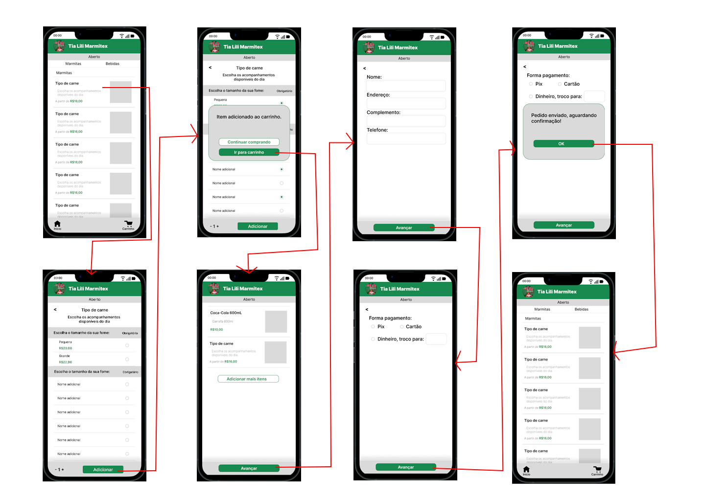

# Informações do Projeto
`TÍTULO DO PROJETO`  

> TRABALHO INTERDISCIPLINAR: APLICAÇÕES PARA PROCESSOS DE NEGÓCIOS: Restaurante da Tia Lili

`CURSO` 

> Sistemas de Informação

## Participantes

> - João José Cardoso Ribeiro
> - Luiz Gustavo Gonçalves Soares Dos Reis
> - Pedro Henrique Fernandes Domingues
> - Vitor Ribeiro Lacerda

# Estrutura do Documento

- [Informações do Projeto](#informações-do-projeto)
  - [Participantes](#participantes)
- [Estrutura do Documento](#estrutura-do-documento)
- [Introdução](#introdução)
  - [Problema](#problema)
  - [Objetivos](#objetivos)
  - [Justificativa](#justificativa)
  - [Público-Alvo](#público-alvo)
- [Especificações do Projeto](#especificações-do-projeto)
  - [Personas e Mapas de Empatia](#personas-e-mapas-de-empatia)
  - [Histórias de Usuários](#histórias-de-usuários)
  - [Requisitos](#requisitos)
    - [Requisitos Funcionais](#requisitos-funcionais)
    - [Requisitos não Funcionais](#requisitos-não-funcionais)
  - [Restrições](#restrições)
- [Projeto de Interface](#projeto-de-interface)
  - [User Flow](#user-flow)
  - [Wireframes](#wireframes)
- [Metodologia](#metodologia)
  - [Divisão de Papéis](#divisão-de-papéis)
  - [Ferramentas](#ferramentas)
  - [Controle de Versão](#controle-de-versão)
- [**############## SPRINT 1 ACABA AQUI #############**](#-sprint-1-acaba-aqui-)
- [Projeto da Solução](#projeto-da-solução)
  - [Tecnologias Utilizadas](#tecnologias-utilizadas)
  - [Arquitetura da solução](#arquitetura-da-solução)
- [Avaliação da Aplicação](#avaliação-da-aplicação)
  - [Plano de Testes](#plano-de-testes)
  - [Ferramentas de Testes (Opcional)](#ferramentas-de-testes-opcional)
  - [Registros de Testes](#registros-de-testes)
- [Referências](#referências)

# Introdução
> Nos dias de hoje, a comida rápida e fácil é super importante para muita gente. Por isso, propõe-se um projeto que irá ajudar pessoas a pedirem marmitas de uma maneira mais simples e moderna. Neste trabalho, destaca-se a busca para juntar a tradição da comida caseira com a praticidade da tecnologia. A pretensão deste projeto é tornar o processo de pedir marmitas mais fácil, rápido e de acordo com o que cada pessoa gosta.

## Problema

> Os métodos convencionais de pedidos de marmitas muitas vezes se mostram desafiadores tanto para os clientes quanto para os estabelecimentos. Atrasos, erros de comunicação, pedidos anotados errados são obstáculos frequentes. Além disso, a falta de personalização nos pedidos pode resultar em experiências menos satisfatórias para os consumidores. O projeto visa solucionar esses problemas, tornando o processo de pedir marmitas mais eficiente, personalizado e alinhado às expectativas contemporâneas.
>

## Objetivos

> O objetivo principal deste projeto é desenvolver um sistema de pedidos de marmitas que ofereça uma experiência mais ágil, personalizada e eficiente tanto para os clientes quanto para o restaurante. Neste projeto, é proposta a criação de uma plataforma intuitiva que permita aos usuários explorar o cardápio, personalizar seus pedidos e acompanhar o status de seus pedidos em tempo real. Ao mesmo tempo, o sistema proporcionará aos estabelecimentos uma gestão mais eficaz dos pedidos, reduzindo erros e aumentando a eficiência operacional.
> 

## Justificativa

> A escolha de desenvolver um sistema de pedidos de marmitas é motivada pela necessidade de oferecer uma solução inovadora que facilite o acesso à alimentação de qualidade em um contexto de vida acelerado. Os objetivos específicos foram definidos para abordar desafios comuns enfrentados tanto pelos consumidores, como erros de comunicação e falta de personalização, quanto pelos estabelecimentos, incluindo a gestão de pedidos e a eficiência operacional. Ao priorizar a agilidade, personalização e eficiência, busca-se não apenas atender às demandas imediatas do mercado, mas também impulsionar a inovação e competitividade na indústria alimentícia, alinhando-se com as expectativas contemporâneas.

## Público-Alvo

>O público alvo deste projeto são profissionais com rotinas ocupadas, como trabalhadores de escritório, autônomos e estudantes, famílias que buscam praticidade e variedade na alimentação e entusiastas da alimentação saudável interessados em opções frescas e equilibradas, pessoas em trânsito, como viajantes e motoristas de aplicativos e também empresas em busca de soluções de alimentação para eventos corporativos, outros públicos também podem ser alcançados.
> 
 
# Especificações do Projeto

> Para estabelecer a definição exata do problema e identificar os principais aspectos a serem abordados no projeto, foi necessário realizar um esforço colaborativo com os usuários. A equipe conduziu um processo imersivo, envolvendo a observação dos usuários em seus ambientes naturais e a realização de entrevistas detalhadas. Os dados e insights obtidos nesse processo foram então cuidadosamente estruturados e categorizados em personas e histórias de usuários. Essas personas e histórias serviram como base sólida para o desenvolvimento do projeto, garantindo que as necessidades e expectativas dos clientes e do restaurante fossem atendidas de forma eficaz e precisa.

## Personas e Mapas de Empatia

> Relacione as personas identificadas no seu projeto e os respectivos mapas de empatia. Lembre-se que 
> você deve ser enumerar e descrever precisamente e de forma
> personalizada todos os principais envolvidos com a solução almeja. 
> 
> Para tanto, baseie-se tanto nos documentos disponibilizados na disciplina
> e/ou nos seguintes links:
>
> **Links Úteis**:
> - [Persona x Público-alvo](https://flammo.com.br/blog/persona-e-publico-alvo-qual-a-diferenca/)
> - [O que é persona?](https://resultadosdigitais.com.br/blog/persona-o-que-e/)
> - [Rock Content](https://rockcontent.com/blog/personas/)
> - [Hotmart](https://blog.hotmart.com/pt-br/como-criar-persona-negocio/)
> - [Mapa de Empatia](https://resultadosdigitais.com.br/blog/mapa-da-empatia/)
> - [Como fazer um mapa de empatia - Vídeo](https://www.youtube.com/watch?v=JlKHGpVoA2Y)
> 
> 
> **Exemplo de Persona**
> 
> 
> 
> 
> 
> 
>
> **mapa de empatia**
>
> 
> 
> 
> 
>
>
> Fonte: [Como criar uma persona para o seu negócio](https://raissaviegas.com.br/como-criar-uma-persona/)

## Histórias de Usuários

Com base na análise das personas forma identificadas as seguintes histórias de usuários:

>
> 
>

|EU COMO... `PERSONA`| QUERO/PRECISO ... `FUNCIONALIDADE` |PARA ... `MOTIVO/VALOR`                 |
|--------------------|------------------------------------|----------------------------------------|
|Usuário do sistema  | Registrar minhas tarefas           | Não esquecer de fazê-las               |
|Administrador       | Alterar permissões                 | Permitir que possam administrar contas |

> Apresente aqui as histórias de usuário que são relevantes para o
> projeto de sua solução. As Histórias de Usuário consistem em uma
> ferramenta poderosa para a compreensão e elicitação dos requisitos
> funcionais e não funcionais da sua aplicação. Se possível, agrupe as
> histórias de usuário por contexto, para facilitar consultas
> recorrentes à essa parte do documento.
>
> **Links Úteis**:
> - [Histórias de usuários com exemplos e template](https://www.atlassian.com/br/agile/project-management/user-stories)
> - [Como escrever boas histórias de usuário (User Stories)](https://medium.com/vertice/como-escrever-boas-users-stories-hist%C3%B3rias-de-usu%C3%A1rios-b29c75043fac)

## Requisitos

As tabelas que se seguem apresentam os requisitos funcionais e não funcionais que detalham o escopo do projeto.

### Requisitos Funcionais

|ID    | Descrição do Requisito  | Prioridade |
|------|-----------------------------------------|----|
|RF-001| Permitir que os usuários se cadastrem no sistema fornecendo informações básicas, como nome, endereço, número de telefone e e-mail | MÉDIA | 
|RF-002| Permitir que os usuários façam login de forma segura utilizando e-mail/senha ou outras formas de autenticação, como login social.   | MÉDIA |
|RF-003| Possibilitar aos usuários visualizar o cardápio completo com todas as opções de marmitas disponíveis, incluindo descrições, preços e imagens.   | ALTA |
|RF-004| Permitir aos usuários adicionar itens selecionados ao carrinho de compras para posterior compra.   | MÉDIA |
|RF-005| Possibilitar aos usuários visualizar e editar os itens no carrinho antes de finalizar a compra, incluindo alteração de quantidade e remoção de itens.   | ALTA |
|RF-006| Disponibilizar uma interface de administração para gerenciar o cardápio, pedidos, usuários, relatórios de vendas, entre outras funcionalidades.   | ALTA |
|RF-007| Permitir que os usuários personalizem seus pedidos, como escolher acompanhamentos, alterar ingredientes, etc., conforme suas preferências.   | ALTA |

### Requisitos não Funcionais

|ID     | Descrição do Requisito  |Prioridade |
|-------|-------------------------|----|
|RNF-001| O sistema deve ser capaz de lidar com múltiplos acessos simultâneos sem degradação significativa do desempenho. | ALTA | 
|RNF-002| Deve garantir a segurança dos dados do usuário, incluindo informações pessoais e dados de pagamento. |  ALTA | 
|RNF-003| A interface do usuário deve ser intuitiva e de fácil navegação, proporcionando uma experiência agradável ao usuário. | MÉDIA | 
|RNF-004| O sistema deve ser confiável e estar disponível 24/7, com mínimo tempo de inatividade para manutenção. |  ALTA | 
|RNF-005| Deve ser compatível com uma variedade de dispositivos e navegadores para garantir acessibilidade a todos os usuários. | ALTA | 
|RNF-006| Deve oferecer suporte a múltiplos idiomas e moedas, se aplicável, para atender a uma base de usuários diversificada. |  BAIXA | 

> Com base nas Histórias de Usuário, enumere os requisitos da sua
> solução. Classifique esses requisitos em dois grupos:
>
> - [Requisitos Funcionais (RF)](https://pt.wikipedia.org/wiki/Requisito_funcional):
>   correspondem a uma funcionalidade que deve estar presente na
>   plataforma (ex: cadastro de usuário).
>
> - [Requisitos Não Funcionais (RNF)](https://pt.wikipedia.org/wiki/Requisito_n%C3%A3o_funcional):
>   correspondem a uma característica técnica, seja de usabilidade,
>   desempenho, confiabilidade, segurança ou outro (ex: suporte a
>   dispositivos iOS e Android).
>
> Lembre-se que cada requisito deve corresponder à uma e somente uma
> característica alvo da sua solução. Além disso, certifique-se de que
> todos os aspectos capturados nas Histórias de Usuário foram cobertos.
> 
> **Links Úteis**:
> 
> - [O que são Requisitos Funcionais e Requisitos Não Funcionais?](https://codificar.com.br/requisitos-funcionais-nao-funcionais/)
> - [O que são requisitos funcionais e requisitos não funcionais?](https://analisederequisitos.com.br/requisitos-funcionais-e-requisitos-nao-funcionais-o-que-sao/)

## Restrições

O projeto está restrito pelos itens apresentados na tabela a seguir.

|ID| Restrição                                             |
|--|-------------------------------------------------------|
|01| O sistema deve ser desenvolvido dentro de um prazo definido, levando em consideração as necessidades do negócio. |
|02| Deve cumprir todas as regulamentações e leis locais relacionadas à segurança de dados e comércio eletrônico.        |

> Enumere as restrições à sua solução. Lembre-se de que as restrições
> geralmente limitam a solução candidata.
> 
> **Links Úteis**:
> - [O que são Requisitos Funcionais e Requisitos Não Funcionais?](https://codificar.com.br/requisitos-funcionais-nao-funcionais/)
> - [O que são requisitos funcionais e requisitos não funcionais?](https://analisederequisitos.com.br/requisitos-funcionais-e-requisitos-nao-funcionais-o-que-sao/)

# Projeto de Interface

> Para solucionar os problemas em evidência, foi elaborado uma interface simples e objetiva para cumprir os requisitos do projeto.

## User Flow

......  INCLUA AQUI O DIAGRAMA COM O FLUXO DO USUÁRIO NA APLICAÇÃO ......

> Fluxo de usuário (User Flow) é uma técnica que permite ao desenvolvedor
> mapear todo fluxo de telas do site ou app. Essa técnica funciona
> para alinhar os caminhos e as possíveis ações que o usuário pode
> fazer junto com os membros de sua equipe.
>
> **Links Úteis**:
> - [User Flow: O Quê É e Como Fazer?](https://medium.com/7bits/fluxo-de-usu%C3%A1rio-user-flow-o-que-%C3%A9-como-fazer-79d965872534)
> - [User Flow vs Site Maps](http://designr.com.br/sitemap-e-user-flow-quais-as-diferencas-e-quando-usar-cada-um/)
> - [Top 25 User Flow Tools & Templates for Smooth](https://www.mockplus.com/blog/post/user-flow-tools)
>
> **Exemplo**:
> 
> 

## Wireframes

......  INCLUA AQUI OS WIREFRAMES DAS TELAS DA APLICAÇÃO COM UM BREVE DESCRITIVO ......

> Wireframes são protótipos das telas da aplicação usados em design de interface para sugerir a
> estrutura de um site web e seu relacionamentos entre suas
> páginas. Um wireframe web é uma ilustração semelhante ao
> layout de elementos fundamentais na interface.
> 
> **Links Úteis**:
> - [Ferramentas de Wireframes](https://rockcontent.com/blog/wireframes/)
> - [Figma](https://www.figma.com/)
> - [Adobe XD](https://www.adobe.com/br/products/xd.html#scroll)
> - [MarvelApp](https://marvelapp.com/developers/documentation/tutorials/)
> 
> **Exemplo**:
> 
> 

# Metodologia

> Devido às entregas incrementais, o grupo decidiu dividir tarefas específicas para cada integrante, com reuniões semanais para acompanhar, tirar dúvidas e todos estarem cientes do andamento de cada detalhe do projeto.

## Divisão de Papéis

> A distribuição dos componentes do grupo, ficou da seguinte forma:

### Scrum Master:

* Vitor Ribeiro Lacerda

### Product Owner:

* João José Cardoso Ribeiro

###	Equipe de Desenvolvimento:

* João José Cardoso Ribeiro

* Luiz Gustavo Gonçalves Soares Dos Reis

* Pedro Henrique Fernandes Domingues

* Vitor Ribeiro Lacerda

> O acompanhamento das tarefas ocorre por meio de reuniões semanais, durante as quais as tarefas em andamento são revisadas. Após a conclusão de cada etapa, verifica-se se todos os interessados estão informados sobre o progresso. Em seguida, novas tarefas são definidas e distribuídas conforme necessário.

## Ferramentas

| Ambiente  | Plataforma              |Link de Acesso |
|-----------|-------------------------|---------------|
|Repositório de código | GitHub | https://github.com/PSG-TIAPN-2022-1/psg-tiapn-2024-1-tia-lili.git | 
|Protótipo Interativo |  Figma | https://www.figma.com/proto/4Qa01m3nE1qLc1lNoUSFKz/Tia-Lili-wireframes?type=design&node-id=12-3&t=h8HIzxR1aQ7VEhhE-1&scaling=scale-down&page-id=0%3A1&starting-point-node-id=46%3A175&mode=design | 

>
> Liste as ferramentas empregadas no desenvolvimento do
> projeto, justificando a escolha delas, sempre que possível.
> 
> As ferramentas empregadas no projeto são:
> 
> - Visual Studio Code
> - Whatsapp e Discord
> 
> O editor de código foi escolhido porque ele possui uma boa integração com o sistema de versão. As ferramentas de comunicação utilizadas são versáteis. O Whatsapp sendo usado para comunicação durante a semana, tanto para dúvidas e sugestões, enquanto o Discord é utilizado para reuniões, possibilitando fácil compartilhamento de tela, chat de texto e voz. 

> **Links Úteis - Hospedagem**:
> - [Getting Started with Heroku](https://devcenter.heroku.com/start)
> - [Crie seu Site com o HostGator](https://www.hostgator.com.br/como-publicar-seu-site)
> - [GoDady](https://br.godaddy.com/how-to)
> - [GitHub Pages](https://pages.github.com/)

## Controle de Versão

> Para versionamento do projeto, os membros do grupo optaram por fazer commits organizados na plataforma GitHub.

# **############## SPRINT 1 ACABA AQUI #############**

# Projeto da Solução

......  COLOQUE AQUI O SEU TEXTO ......

## Tecnologias Utilizadas

......  COLOQUE AQUI O SEU TEXTO ......

> Descreva aqui qual(is) tecnologias você vai usar para resolver o seu
> problema, ou seja, implementar a sua solução. Liste todas as
> tecnologias envolvidas, linguagens a serem utilizadas, serviços web,
> frameworks, bibliotecas, IDEs de desenvolvimento, e ferramentas.
> Apresente também uma figura explicando como as tecnologias estão
> relacionadas ou como uma interação do usuário com o sistema vai ser
> conduzida, por onde ela passa até retornar uma resposta ao usuário.
> 
> Inclua os diagramas de User Flow, esboços criados pelo grupo
> (stoyboards), além dos protótipos de telas (wireframes). Descreva cada
> item textualmente comentando e complementando o que está apresentado
> nas imagens.

## Arquitetura da solução

......  COLOQUE AQUI O SEU TEXTO E O DIAGRAMA DE ARQUITETURA .......

> Inclua um diagrama da solução e descreva os módulos e as tecnologias
> que fazem parte da solução. Discorra sobre o diagrama.
> 
> **Exemplo do diagrama de Arquitetura**:
> 
> 

# Avaliação da Aplicação

......  COLOQUE AQUI O SEU TEXTO ......

> Apresente os cenários de testes utilizados na realização dos testes da
> sua aplicação. Escolha cenários de testes que demonstrem os requisitos
> sendo satisfeitos.

## Plano de Testes

......  COLOQUE AQUI O SEU TEXTO ......

> Enumere quais cenários de testes foram selecionados para teste. Neste
> tópico o grupo deve detalhar quais funcionalidades avaliadas, o grupo
> de usuários que foi escolhido para participar do teste e as
> ferramentas utilizadas.
> 
> **Links Úteis**:
> - [IBM - Criação e Geração de Planos de Teste](https://www.ibm.com/developerworks/br/local/rational/criacao_geracao_planos_testes_software/index.html)
> - [Práticas e Técnicas de Testes Ágeis](http://assiste.serpro.gov.br/serproagil/Apresenta/slides.pdf)
> -  [Teste de Software: Conceitos e tipos de testes](https://blog.onedaytesting.com.br/teste-de-software/)

## Ferramentas de Testes (Opcional)

......  COLOQUE AQUI O SEU TEXTO ......

> Comente sobre as ferramentas de testes utilizadas.
> 
> **Links Úteis**:
> - [Ferramentas de Test para Java Script](https://geekflare.com/javascript-unit-testing/)
> - [UX Tools](https://uxdesign.cc/ux-user-research-and-user-testing-tools-2d339d379dc7)

## Registros de Testes

......  COLOQUE AQUI O SEU TEXTO ......

> Discorra sobre os resultados do teste. Ressaltando pontos fortes e
> fracos identificados na solução. Comente como o grupo pretende atacar
> esses pontos nas próximas iterações. Apresente as falhas detectadas e
> as melhorias geradas a partir dos resultados obtidos nos testes.

# Referências

......  COLOQUE AQUI O SEU TEXTO ......

> Inclua todas as referências (livros, artigos, sites, etc) utilizados
> no desenvolvimento do trabalho.
> 
> **Links Úteis**:
> - [Formato ABNT](https://www.normastecnicas.com/abnt/trabalhos-academicos/referencias/)
> - [Referências Bibliográficas da ABNT](https://comunidade.rockcontent.com/referencia-bibliografica-abnt/)
